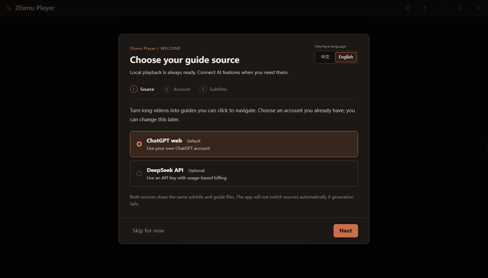

# Zhimu Player · 知幕

[简体中文](./README.md) · [English](./README.en.md)

[GitHub repository](https://github.com/OJY-lawyer/zhimu-player) · [Download rc.10](https://github.com/OJY-lawyer/zhimu-player/releases/tag/v1.2.0-rc.10) · [Report an issue](https://github.com/OJY-lawyer/zhimu-player/issues)

A Windows desktop workspace for video reading with AI: watch long recordings, browse subtitles and create timestamped reading guides. Open one video or a folder of lecture, livestream or course recordings and navigate them in one window.

One application includes both **ChatGPT web** (the default) and **DeepSeek API**. Optional speech recognition uses **Tongyi Tingwu** to create SRT subtitles. Existing SRT files work without a transcription account.


Watch with subtitles and switch the right panel between the playlist, subtitles and reading guide. Example video: 热爱干饭饭 on bilibili. The interface also supports English, as shown below.

## Release candidate: 1.2.0-rc.10

**This is a release candidate for users to try, not a stable release.** rc.10 fixes Cookie import rollback, incomplete multiline prompts and response retrieval in new chats. Import cookies from a file, the clipboard or pasted JSON using the visible connection buttons. Model and reasoning choices are separate, including Sol Pro and Astra Pro when available in the website menu. Sidebar subtitles stay highlighted through gaps and pauses.

This release passed 25 offline test files, type checks and the build, 19 real Electron playback checks and 15 synthetic Cookie protocol checks in real Edge. A local installation upgrade preserved four settings, playback and sign-in files. A real account generated and retrieved a complete timestamped guide from **short synthetic text using Sol · Medium**. Both Pro choices were checked in the menu and selected, but were not used to generate. Long transcripts or attachments, generation with Pro or other untested levels, new Tingwu jobs, other machines and GitHub differential updates remain unverified. See the [rc.10 release notes](./docs/RELEASE-1.2.0-rc.10.md).

Choose a file under **Assets** on the [v1.2.0-rc.10 download page](https://github.com/OJY-lawyer/zhimu-player/releases/tag/v1.2.0-rc.10):

| File | Purpose |
|---|---|
| `Zhimu-Player-1.2.0-rc.10-Setup-x64.exe` | Windows x64 installer for the current user |
| `Zhimu-Player-1.2.0-rc.10-Portable-x64.exe` | Windows x64 portable application |
| `Zhimu-Player-1.2.0-rc.10-Source.zip` | Clean source archive with a manifest and SHA-256 checksum |
| `Zhimu-Player-1.2.0-rc.10-Setup-x64.exe.blockmap`, `latest.yml` | Installed-edition update assets; no need to open these manually |

Previously named AI Video Player, **Zhimu Player · 知幕** continues its existing features and data formats. The [rc.8 notes](./docs/RELEASE-1.2.0-rc.8.md) remain a historical record. These builds are unsigned, so Windows may show an unknown publisher; check the download source. Report problems through [Issues](https://github.com/OJY-lawyer/zhimu-player/issues) with the version, reproduction steps and error text. Do not include account details, cookies, API keys or private media.

## Install and get started

The instructions below apply to the rc.10 release candidate.



Choose your language and guide source on first launch. Connect an existing account, or skip setup and start with local playback.

1. Run the **Setup-x64.exe** you received and select English or Simplified Chinese and an installation folder. For an existing installation, close the player and install into the same folder without uninstalling first; the local rc.10 in-place upgrade and data preservation checks passed. For a trial without installation, run the matching **Portable-x64.exe**.
2. On first launch, use the visible **中文 / English** buttons at the top. All setup instructions, step descriptions and messages switch immediately, and your choice is saved automatically. The same buttons are available at the top of Settings. You can skip cloud setup and play local videos immediately.
3. **ChatGPT web** settings show three visible buttons: **Open sign-in**, **Import cookies** and **Check connection**. Sign in manually in the dedicated Edge window, close it, then check the connection. Alternatively, select **Import cookies** and choose a Cookie-Editor JSON file, the clipboard, or **Paste JSON**. Select the website model and reasoning level separately; use **Refresh options from ChatGPT** to read the account's menu. Plus/Pro no longer locks the model. Manual sign-in is not automated, and your everyday Edge profile stays separate.
4. For **DeepSeek API**, enter your own API key. The app fetches models when you leave the key field. Choose a model and save; use **Refresh models** whenever needed. Your existing selection is never replaced automatically. API access, model availability and charges depend on your provider account.
5. To generate subtitles, sign in to **Tingwu** from the player and select the actual speech language of your video: **Chinese** or **English**. You can skip this if you already have subtitles.
6. Open a video or folder. Generate any missing subtitles, then choose **Simplified Chinese**, **English** or **Match subtitles** in the Guide panel and generate a new guide.

The installer contains the application runtime. End users do not need Node.js, Python, an ASR skill or Codex. The ChatGPT web workflow requires **Microsoft Edge**. You handle account passwords, verification codes and service consent directly on the provider’s page. An agent can help with deployment, but ordinary installation and onboarding do not require one.

Tingwu’s sign-in and service pages are provided by Tingwu and may remain in Chinese. The player does not promise access from every country or account. Local playback and existing subtitles remain usable if you cannot use Tingwu.

## Three separate language choices

| Setting | Choices | What changes |
|---|---|---|
| Interface language | Simplified Chinese / English | Application controls, onboarding, settings and known status messages |
| Guide output language | Simplified Chinese / English / Match subtitles | The next generated guide; “Match subtitles” uses the main language of the subtitles |
| Tingwu speech language | Chinese / English | Speech recognition for the selected media |

These settings are independent. Changing the interface does not translate your videos, subtitles, existing guides or filenames. For example, you can use the English interface, transcribe Chinese speech and generate an English guide.

New setups default to **Match subtitles** for guide output; existing configurations without a guide language retain Chinese. The initial speech-language choice for a new setup follows the system language, but you should set it to the language actually spoken in the video. Existing configurations without a Tingwu language retain Chinese. Later interface or guide-language changes do not change the speech-language setting.

## Guide providers

| Provider | Setup | Account and billing |
|---|---|---|
| ChatGPT web, default | Sign in in the regular dedicated Edge window or explicitly import cookies, then choose a website model and reasoning level | Uses the models and limits available to your ChatGPT web account |
| DeepSeek API | Enter your API key and choose from the models returned by your API | Billed separately through your DeepSeek API account |

The player checks the chosen ChatGPT model and reasoning setting before sending subtitles. If they are unavailable or the page has changed, generation stops with an error. It does not silently downgrade or switch providers. Presets are candidates, not verified account entitlements. Valid existing selections are retained; the app asks for a change only when an option is missing or cannot be confirmed.

The website checks in this round confirmed **Sol: Instant / Medium / High / Extra High / Pro**, and **Astra: Pro**. Availability follows the actual account menu. Other levels under Latest without an explicit family badge are not assumed to be Astra.

ChatGPT web does not require Codex to be installed or signed in. Network errors, timeouts and human-verification pages show their specific cause with an **unknown** status, retaining the last confirmed sign-in record rather than declaring the account signed out or clearing its session.

Cookie import reads a local file, the clipboard or JSON you paste only after your explicit action. It accepts a JSON array or `cookies` list, up to 2 MiB and 2,000 entries. Only valid cookies for `chatgpt.com` and its subdomains are accepted; unrelated, expired or invalid entries are skipped. The app does not copy your everyday browser profile or display the contents read from files or the clipboard. The paste field clears on submission, closing or switching providers, and its contents are never saved in settings. Import checks the connection, but an import count is not proof of authentication. Complete any website security check yourself. Regular dedicated-window sign-in remains available.

ChatGPT web, Codex subscriptions and OpenAI API access are separate channels. Installing the player or asking Codex to deploy it does not transfer allowances between them. This project is an independent tool, not an official OpenAI, DeepSeek or Alibaba product.

Switching between ChatGPT and DeepSeek retains both sets of settings, the ChatGPT sign-in data and your saved DeepSeek key. Switching itself does not sign you out. Explicit sign-out, deleting a key, or a session expiring at the service are separate actions.

## Everyday use

The installed edition supports **Settings → About & support → App updates**. Check manually, download the update, and restart when ready. It downloads changed blocks when possible, falls back to a full installer when needed, and keeps your installation folder and user data. Install the first updater-enabled version manually once. See [App updates](./docs/APP-UPDATES.md).

- **Open a folder** to create a playlist from video files directly inside it. Subfolders are not scanned. Files are naturally sorted, such as P1, P2 and P10; drag to reorder or restore filename order.
- **Open one video** to create a single-item playlist. Other files in its folder are not automatically added. You can also drop a video or folder onto the player.
- Move the pointer to the right edge to open the workspace with **Playlist**, **Subtitles** and **Guide** tabs. Pin it to keep it open and drag its left edge to resize. The workspace also works in fullscreen.
- Playback position, speed, watched status and subtitle styling are restored. Video always retains its aspect ratio.
- Click a subtitle or click/drag the progress bar to seek. The volume slider adapts to the available player area. Use the wheel over the video, volume button or volume slider to adjust volume within 0–100%.
- Press **Ctrl+F** to search subtitles across all Parts and the current guide.

### Playback shortcuts

| Action | Shortcut |
|---|---|
| Play / pause | Space |
| Seek backward / forward 1 second | Left / Right |
| Seek backward / forward 10 seconds | Ctrl + Left / Right |
| Seek backward / forward 30 seconds | Shift + Left / Right |
| Adjust volume | Up / Down |
| Mute | M |
| Show / hide subtitles | S |
| Toggle fullscreen | F |
| Leave fullscreen | Esc |
| Search subtitles and guide | Ctrl + F |

Click the video to play or pause; double-click to toggle fullscreen. During playback, the controls hide after roughly two seconds without pointer movement.

### Subtitles

The player discovers a matching `video-name.srt` automatically. If timestamped revisions such as `video-name.YYYYMMDD-HHMMSS.srt` exist, it selects the newest revision first.

When subtitles are missing, the subtitle task bar offers generation through Tingwu. Media is uploaded sequentially; SRT files are written beside the videos and reloaded automatically. The built-in workflow does not also produce a transcription Markdown file. Cancelling stops local waiting and future uploads; it does not delete tasks already submitted to Tingwu.

An empty or invalid matching SRT is preserved and reported as an error. Rename it as a backup before retrying; the player does not overwrite it just because it is invalid.

Click a subtitle to seek. Right-click it to edit the text or timing. Saving creates a timestamped SRT revision and keeps the original; subsequent edits during the same run update that revision. Subtitle settings include size, visibility, timing offset, vertical position and background opacity. Timing offset is saved per video. Manual scrolling pauses subtitle following; use the return-to-current-subtitle action to resume it.

### Reading guides

Existing Markdown guides load directly. A version selector lets you switch between guides in the same folder. Editing automatically saves to the current guide file. New guide generation requires valid subtitles for every video in the playlist.

Each new guide records the original mapping between Part numbers and video filenames in a hidden `ai-video-player-guide:` comment. Timestamp links such as `[P2-01:23:45]` use this mapping, so reordering the playlist does not redirect them to another video. The player preserves the mapping while displaying or editing the body; keep it when editing the file externally.

Older multi-video guides without a reliable mapping remain readable, editable and searchable, but timestamp navigation is disabled. Regenerate a guide to restore reliable links. Older single-video guides can use the only video. Missing, renamed or duplicate filenames disable links that cannot be matched uniquely; damaged mapping data disables timestamp navigation.

The ChatGPT workflow uses its own Edge profile, separate from everyday browsing. A normal new conversation is the default; you do not need a project with a specific name. An optional project can be set in advanced settings. If the new conversation does not belong to the requested project, the guide is not saved.

Tasks up to 120,000 characters are entered directly into the conversation. Longer tasks use a text attachment and wait for upload readiness. The result is checked for guide structure and timestamps before being saved as a new Markdown version.

Guide generation uses DeepSeek only after you explicitly select and save the API provider. Model names are fetched through [`GET /models`](https://api-docs.deepseek.com/api/list-models/), without a built-in allowlist. Leaving the key or API URL field fetches the list; opening API settings with a saved key also refreshes it. Listing models sends no subtitles and does not generate a guide. API keys and web subscriptions are independent.

A temporary network failure may show a clearly marked list cached during the current app session, isolated to that API endpoint and key. Authentication failures discard that cache. A missing selection is flagged and never replaced automatically. If your compatible API cannot list models, enter the exact name in **Advanced settings**. The list does not describe model capabilities or pricing.

## Troubleshooting

| Problem | What to do |
|---|---|
| Microsoft Edge is missing | Install or repair Edge, or explicitly select DeepSeek API |
| Sign-in window still asks you to sign in | Complete the provider’s verification step, then return and check again |
| ChatGPT status cannot be confirmed | Retry after checking the network or completing verification. This is not proof that your session expired; the app preserves the last confirmed record |
| Cookie import fails | Read the specific message in the connection area. Export JSON from the signed-in chatgpt.com page, check the 2 MiB / 2,000-entry limits, then use file, clipboard or pasted JSON import. Do not share the export |
| ChatGPT model or reasoning option cannot be confirmed | Check your actual account options in the dedicated window. Keep the error stage for a compatibility report; the player does not downgrade |
| DeepSeek rejects authentication, credit or model access | Check your own API key, balance and model permissions with the provider |
| Tingwu sign-in expires | Reopen its sign-in window in Settings and sign in again |
| Subtitles fail to generate | Check Tingwu sign-in, speech language, service access, network and write access to the video folder |
| An earlier upload is incomplete or uncertain | Check the task on Tingwu. Ask your deployment agent to review the specific local task-history entry before resuming; do not repeatedly upload the same file |
| Video or audio will not play | A supported filename extension does not guarantee a supported codec. Use a file encoded in a Chromium-compatible format |
| English interface still shows Chinese subtitles or an older guide | Interface changes preserve user content. Select English guide output and generate a new version if needed |
| An error includes “Additional details” and Chinese text | The player is preserving an unmapped service detail for diagnosis, not reporting success |
| Windows shows an unknown publisher | Current builds are unsigned. Check the download source and published SHA-256 before deciding whether to run them |

The file picker accepts MP4, MKV, AVI, WebM, MOV, M4V and TS. Playback still depends on their internal codecs. The player does not automatically transcode or modify the original video. The built-in Tingwu upload flow does not accept TS; convert it to MP4 first.

When reporting a problem, include the app version, Windows version, provider, reproduction steps and error text. Remove personal filenames and account information from screenshots. Do not post API keys, cookies, browser profiles, user-data folders or private media.

## Build it yourself or hand it to an agent

Read [AGENTS.md](./AGENTS.md) and the [deployment contract](./docs/AGENT-DEPLOYMENT.md). Source builds need Node.js 22.12 or a newer compatible version; Node 22 LTS is recommended for the locked dependency set. The 1.0.0 build used Node 22.22.2; check the current validation record for later results.

```sh
npm ci
npm run setup:runtime
npm run doctor
npm run typecheck
npm test
npm run build
```

For a fresh source checkout, `setup:runtime` uses Electron's own installer to prepare the project-local runtime before the read-only checks. Existing files are reused. Installer users do not need these commands.

- `npm run dev` opens the development application.
- `npm run build:app` builds the app without installers.
- `npm run build:dir` creates an unpacked build for inspection.
- `npm run build` produces the current-user installer and portable edition in `release/`; it does not publish them.
- `npm run test:playback` exercises real playback, subtitle/progress seeking and volume controls with isolated data and silent synthetic media. Add `-- --slow-media` to test before the file has fully loaded.
- `npm run public:check` scans the public file allowlist. `npm run public:export -- --output outputs` exports a clean source ZIP with a file manifest and SHA-256 checksum.

The source project folder is now named `zhimu-player`. To preserve upgrade data, the internal application ID remains `com.videoplayer.app`, the user-data folder remains `video-player`, and existing localStorage keys and `ai-video-player-guide:` guide markers remain compatible. These are internal data identifiers and must not be renamed by a blanket replacement. Users do not need to move sign-in sessions or media manually because of the product rename.

An example instruction for your own deployment agent:

> Deploy Zhimu Player according to AGENTS.md. Reuse a suitable existing Node.js installation, install project dependencies, run the checks and build, then open onboarding in English. I will handle account sign-in myself. Keep ChatGPT web as the default and let me choose the website model and reasoning level. Do not upload my configuration or publish a repository.

Use project-local dependencies. Do not copy another app’s browser profile or credentials, install unrelated ASR software, or change shared system services. The doctor command checks the environment without reading account data; a successful doctor result does not prove cloud access.

Use the public exporter for GitHub sharing. Do not upload the original development directory, which may contain local state, private configuration, experiments and work files. The export includes the English README and license reference translation, source, release documents, selected scripts, workflows, icons and the author-approved About images. It excludes private data directories and rejects symbolic links and unexpected files. ZIP export refuses to overwrite an existing file with the same name.

## Data and verification

Local playback requires no account. Subtitle generation uploads the selected media to Tingwu. Guide generation sends subtitles and task text to the selected model provider. API keys are encrypted for the current Windows account; sign-in sessions and playback state remain in the player’s user-data directory. Copying the portable EXE does not transfer sign-in sessions.

Original videos and subtitles are preserved. Subtitle revisions and guide versions are saved beside the media. Cancelling locally does not remove already uploaded cloud records; manage those on the provider’s website.

Provider pages, account permissions and web interfaces may change. Passing offline tests or building an installer does not prove that real accounts, long recordings or a new machine work. Follow the [release checklist](./docs/RELEASE-CHECKLIST.md) and report the actual scope. Current releases have no code signature.

The [1.1.2 dynamic model discovery record](./docs/VALIDATION-1.1.2.md), [1.1.0 language adaptation and Astra Pro record](./docs/VALIDATION-1.1.0.md), [1.0.0 record](./docs/VALIDATION-2026-09-14.md) and rc.8 results remain historical records. They do not establish that rc.10 passed the same checks. This round's real ChatGPT evidence covers account reconnection, menu selection and one guide generated from short synthetic text with Sol Medium. It does not validate long transcripts or attachment uploads, generation with other models, DeepSeek, Tingwu, other machines or differential updates. See the [rc.10 verification scope](./docs/RELEASE-1.2.0-rc.10.md).

## Author, support and license

Author: **欧俊言律师 (Ou Junyan, Attorney)**. The About page includes the author’s WeChat contact and optional sponsorship images. The original QR image content is preserved; sponsorship does not grant a commercial license.

This project uses the custom [Zhimu Player Free Use, No Commercial Redistribution and Attribution License 1.0](./LICENSE). It is **source-available, not OSI-approved open-source software**. An [English reference translation](./docs/LICENSE.en.md) is provided for convenience; the Chinese LICENSE is the governing text, and the translation does not add or change permissions.

The rename continues the same project. Only the project display name in the license has changed; its version remains 1.0, with the same permissions, restrictions, attribution requirements and treatment of third-party rights.

**Free use in ordinary work is allowed**, including use by lawyers and company employees, internal processing of work videos, self-deployment and assistance from your own agent. Normal salaries, professional-service fees and independent model-service charges do not make those ordinary uses prohibited.

Without separate written permission from the author, you may not **sell the software, charge others to deploy it, offer its features as a paid service, or bundle or integrate it into commercial products or services offered to others**. Preserve LICENSE, [NOTICE](./NOTICE), the author’s attribution and existing About-page credit. Identify redistributed modifications. Third-party components retain their own licenses; see [third-party notices](./docs/THIRD-PARTY-NOTICES.txt).
