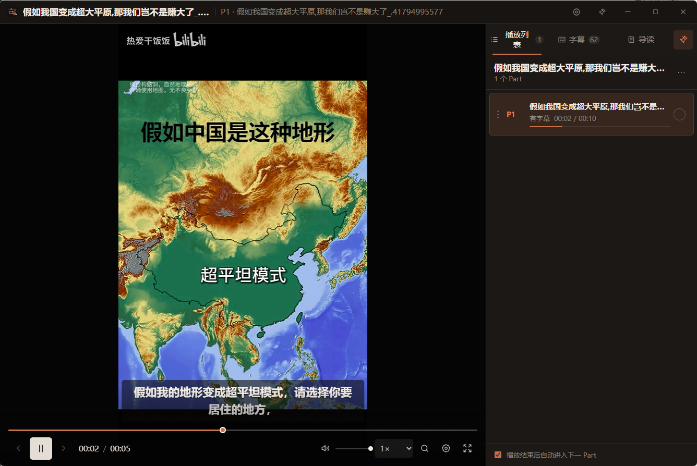
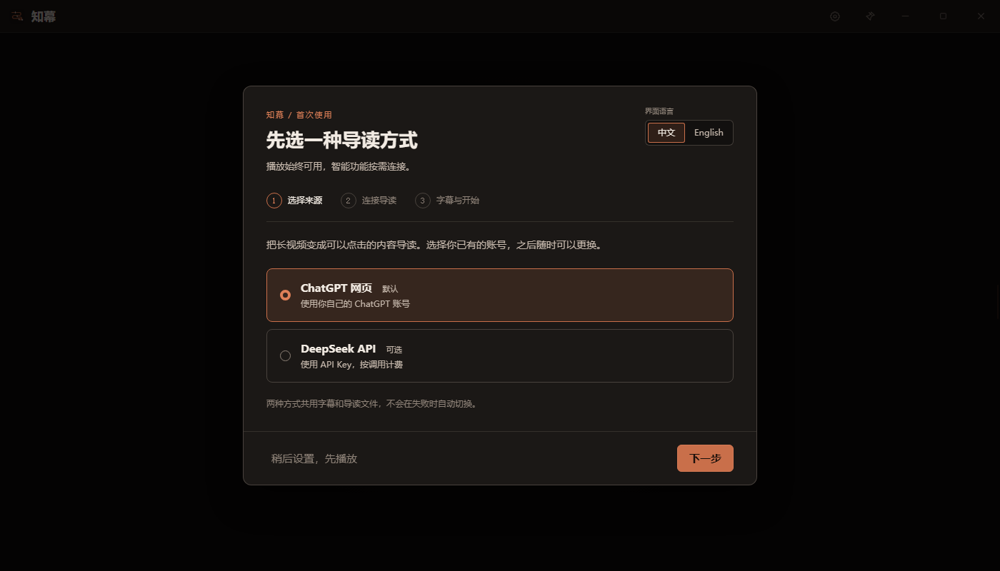

# 知幕 Zhimu Player

[简体中文](./README.md) · [English](./README.en.md)

[GitHub 仓库](https://github.com/OJY-lawyer/zhimu-player) · [下载 rc.10](https://github.com/OJY-lawyer/zhimu-player/releases/tag/v1.2.0-rc.10) · [问题反馈](https://github.com/OJY-lawyer/zhimu-player/issues)

面向长直播、课程和多 Part 录像的 Windows 本地 AI 视频阅读工作台。播放视频、浏览字幕、生成带时间戳的内容导读，在同一个窗口完成。

一个安装包，在设置中选择 ChatGPT 网页或 DeepSeek API。字幕识别使用通义听悟，内置流程生成 SRT；已有 SRT 时可以直接使用。



边看视频边读字幕，右侧随时切换播放列表、字幕和导读。示例视频画面：热爱干饭饭 / 哔哩哔哩。

## 候选版：1.2.0-rc.10

**这是供用户试用的候选版，并非稳定版。** rc.10 修复 Cookie 导入回滚、多行导读任务漏写和新对话回答取回问题；提供文件、剪贴板和粘贴 JSON 三种导入方式，突出登录与连接按钮。模型与推理档位分别选择，支持实际网页中的 Sol Pro 和 Astra Pro；字幕列表在空档和暂停时继续高亮当前位置。

本版通过 25 个离线测试文件、类型检查与构建、19 项真实 Electron 播放检查和 15 项真实 Edge 合成 Cookie 协议检查。本机安装升级保留 4 份设置、播放与登录数据文件；实际账号用 **Sol · 中** 完整生成并取回带时间戳的短合成文本导读。两种 Pro 仅验证菜单及切换；长字幕或附件上传、Pro 等其他档位生成、听悟新任务、其他机器及 GitHub 增量更新仍未验收。详见 [rc.10 版本说明](./docs/RELEASE-1.2.0-rc.10.md)。

请在 [v1.2.0-rc.10 下载页](https://github.com/OJY-lawyer/zhimu-player/releases/tag/v1.2.0-rc.10) 的 **Assets** 中选择文件：

| 文件 | 用途 |
|---|---|
| `Zhimu-Player-1.2.0-rc.10-Setup-x64.exe` | Windows x64 当前用户安装程序 |
| `Zhimu-Player-1.2.0-rc.10-Portable-x64.exe` | Windows x64 便携程序 |
| `Zhimu-Player-1.2.0-rc.10-Source.zip` | 清洁源码包，附清单和 SHA-256 校验 |
| `Zhimu-Player-1.2.0-rc.10-Setup-x64.exe.blockmap`、`latest.yml` | 安装版更新器使用的附件，无需手动打开 |

项目原名为 AI Video Player，现为「知幕 Zhimu Player」，延续已有功能和数据格式。[rc.8 说明](./docs/RELEASE-1.2.0-rc.8.md) 保留为历史记录。当前构建未签名，Windows 可能显示发布者未知；请核对下载来源。使用中发现问题，可在 [Issues](https://github.com/OJY-lawyer/zhimu-player/issues) 提供版本、复现步骤和错误文字，不要上传账号信息、Cookie、API Key 或私人视频。

## 安装后怎么用

以下说明适用于 rc.10 候选版。



首次打开就能切换中文 / English，按引导连接已有账号，也可以稍后设置、先播放。

1. 运行取得的 **Setup-x64.exe**，选择安装语言和目录。已有安装版可关闭播放器后安装到原目录，无需先卸载；rc.10 已完成本机覆盖升级及数据保留验证。希望免安装试用时，可运行对应版本的 **Portable-x64.exe**。
2. 首次引导顶部直接提供「中文｜English」按钮，点击立即切换全部引导文案、步骤说明和提示，并自动保存；设置页顶部也有相同按钮。再按引导选择导读来源，默认是 ChatGPT 网页。
3. ChatGPT 设置直接显示“打开登录窗口”“导入 Cookie”“检查连接”三个按钮。可在普通 Edge 专用窗口手动登录，关闭该窗口后检查连接；也可点击“导入 Cookie”，选择 Cookie-Editor JSON 文件、剪贴板，或“粘贴 JSON”后导入。随后分别选择网页模型和推理档位；可“从 ChatGPT 刷新可用选项”，不再按 Plus/Pro 固定模型。登录阶段不进行浏览器自动控制，日常 Edge 保持独立。
4. DeepSeek 用户在同一引导中填写自己的 API Key，离开输入框后自动获取可用模型，再从列表选择并保存。可随时点击“刷新模型”；已有模型选择不会被自动替换。模型、接口和费用以账号实际权限为准。
5. 需要自动生成字幕时，打开听悟登录窗口完成登录，并按视频实际语音选择中文或英语；也可以跳过，先使用已有字幕。听悟登录页和服务本身由服务方提供，不保证英文界面或所有地区可用。
6. 打开视频或文件夹。缺字幕时点击“生成字幕”；字幕齐全后，在导读面板选择输出语言（简体中文、English、跟随字幕），再生成导读。

界面语言、导读输出语言和听悟语音语言分别设置，互不联动。切换界面不会翻译视频、字幕或已有导读，也不会改写用户文件。新用户导读默认“跟随字幕”；旧配置缺少导读语言时保持中文。新用户听悟语音初始选择参考系统语言，使用前仍须按视频实际语音选择；旧用户未设置听悟语音语言时继续按中文转写。

安装包已包含播放器运行环境，不需要先安装 Node.js、Python、ASR Skill 或 Codex。ChatGPT 网页路线需要 Microsoft Edge。账号登录、验证码和服务授权仍由用户自己完成。普通安装与首次引导可以标准化；让 agent 部署是可选的维护方式。

## 两种导读来源

| 来源 | 首次设置 | 账号与费用 | 适合场景 |
|---|---|---|---|
| ChatGPT 网页（默认） | 普通专用 Edge 登录或主动导入 Cookie，再选择网页模型和推理档位 | 使用 ChatGPT 网页账号实际提供的模型与限额 | 已有可用网页账号 |
| DeepSeek API | 填写自己的 API Key，从接口返回的列表选择模型 | 由 DeepSeek API 账号单独计费 | 希望使用 API 接口 |

播放器不会在失败时暗中切换模型、降低推理档位或改用另一来源。ChatGPT 网页、Codex 订阅和 OpenAI API 是不同接入渠道；安装播放器或交给 Codex 部署，不会使这些额度相互转换，也不保证特定账号能访问指定网页模型。

网页方案无需安装或登录 Codex。内置网页模型预设仅供选择，不能证明当前账号可用；刷新列表后仍保留原选择，每次生成前核对模型和推理档位。有效的已有配置继续保留，只有选项缺失或无法确认时才提示处理。网络错误、超时或人机验证会显示具体原因及“暂时无法确认”状态，保留上次已确认记录，不直接判为掉线或清除登录态。

本轮实际网页已核对 **Sol：即时／中／高／极高／Pro**，以及 **Astra：Pro**。列表以当前账号实际菜单为准；“最新”下没有模型家族标识的其他档位不会被推断为 Astra。

Cookie 导入仅在用户主动操作时读取文件、剪贴板或当次粘贴的 JSON，接受 JSON 数组或 `cookies` 列表，最多 2 MiB、2000 条；只接收 `chatgpt.com` 及其子域的有效 Cookie，跳过无关、过期或不合法条目。导入不会复制整个日常浏览器配置，也不回显文件或剪贴板正文；粘贴框在提交、关闭或切换来源后清空，内容不写入设置。导入会检查连接，但导入数量不等于认证成功；遇到网页安全验证须由用户完成。普通专用窗口登录始终保留，详见 [登录与故障处理](./docs/LOGIN-AND-TROUBLESHOOTING.md)。

模型列表通过服务方的 [`GET /models`](https://api-docs.deepseek.com/zh-cn/api/list-models/) 获取，不再限制为内置名单。刷新遇到临时网络故障时，可使用本次启动中同一接口、同一 Key 的缓存，并明确标注；认证失败会清除该缓存。当前选择不在列表中时会提示，仍由用户选择或在高级设置手动确认。兼容接口未提供列表时可手动填写准确名称。获取列表不会生成导读或发送字幕，列表也不代表模型能力或价格。

## 日常功能

- 单视频和文件夹统一为播放列表，自然排序并支持拖动重排。
- 右侧工作区按需展开，包含播放列表、字幕和导读，全屏下仍可使用。
- 播放位置、倍速、观看状态和字幕样式自动恢复。
- 点击字幕、点击或拖动进度条可以跳转；音量条按播放区域宽度适配。鼠标位于视频、音量按钮或音量条时可滚轮调音量，限制在 0–100%。
- 同名 SRT 自动发现；字幕可浏览、跳转和修订，保留原字幕。
- Markdown 导读支持多个版本、就地编辑与跨 Part 时间戳跳转。新导读记录 Part 对应的视频文件名，调整播放列表顺序后仍按该对应关系跳转。
- `Ctrl+F` 搜索全部 Part 字幕和当前导读。

详细操作见 [使用说明](./使用说明.md)，登录故障见 [登录与故障处理](./docs/LOGIN-AND-TROUBLESHOOTING.md)。

安装版可在“设置 → 关于与支持 → 应用更新”手动检查、下载并重启更新。优先下载变化部分，必要时回退完整包，保留安装目录和用户数据。首个支持应用内更新的版本须手动安装一次。详见 [应用更新](./docs/APP-UPDATES.md)。

旧的多视频导读如果没有可靠的原始 Part 对应记录，仍可阅读、编辑和搜索，但不再按当前播放列表顺序猜测跳转；重新生成后可恢复可靠跳转。视频缺失、改名或重名时，只停用不能可靠匹配的时间戳。

## 交给 agent 或自行构建

使用源码包中的 [AGENTS.md](./AGENTS.md) 和 [部署契约](./docs/AGENT-DEPLOYMENT.md)。开发需要 Node.js 22.12 或更高的兼容版本，推荐 Node.js 22 LTS；本次锁定依赖使用 Node.js 22.22.2 验证。

```sh
npm ci
npm run setup:runtime
npm run doctor
npm run typecheck
npm test
npm run build
```

首次源码部署先运行 `setup:runtime`，由 Electron 自带安装器准备项目内运行文件；后续已安装时直接复用。安装包用户不需要执行这些命令。

`npm run dev` 启动开发窗口，`npm run build:app` 仅构建程序；`npm run build` 在 `release/` 生成可选安装目录的当前用户安装程序和便携版，不自动发布。公开源码使用 `npm run public:export` 的白名单导出文件，不要上传包含历史实验和个人配置的开发目录。

`npm run test:playback` 在隔离的真实 Electron 窗口中检查字幕跳转、进度条和音量；加 `-- --slow-media` 可模拟本地媒体尚未读完。使用无音轨的合成视频，不读取个人媒体或调用云服务。

源码项目目录统一使用 `zhimu-player`。为保留旧版升级数据，内部应用标识继续使用 `com.videoplayer.app`，用户数据目录名继续为 `video-player`，已有 localStorage 协议键和导读中的 `ai-video-player-guide:` 标记保持兼容。它们是内部数据标识，不应随产品更名批量替换，也不需要用户手动迁移登录态或媒体文件。

## 数据与验收边界

本地播放不需要账号。生成字幕会向听悟上传选中的媒体；生成导读会向所选模型服务发送字幕和任务文本。播放器登录态保留在自己的用户数据中；不要向他人分享用户数据目录或 API Key。取消本地任务不会自动删除已经上传到服务端的记录。

网页流程会随服务页面、风控和账号权益变化；听悟网页接口同样需要持续适配。离线测试和成功构建不等于真实账号、长视频或新机器已验收。每次对外发布应完成 [发布验收清单](./docs/RELEASE-CHECKLIST.md)，并标明实际测试范围。当前发行不含代码签名，Windows 可能显示发布者未知。

AI Video Player 旧名时期的历史记录：[1.1.2 模型自动发现](./docs/VALIDATION-1.1.2.md)、[1.1.0 语言适配与 Astra Pro](./docs/VALIDATION-1.1.0.md)、[1.0.0](./docs/VALIDATION-2026-09-14.md)。这些记录及 rc.8 的验证保留原文，不代表 rc.10 已通过同一检查。本轮真实 ChatGPT 证据仅覆盖实际账号连接、菜单切换及 Sol 中档的短合成文本生成；长字幕或附件上传、其他模型生成、DeepSeek、听悟、跨机器及增量更新均未据此验收。详见 [rc.10 验证范围](./docs/RELEASE-1.2.0-rc.10.md)。

## 许可与署名

作者：**欧俊言律师**。项目采用自定义的 [知幕 Zhimu Player 免费使用、禁止商业再分发与署名许可 1.0](./LICENSE)，属于源码可用项目，**并非 OSI 认可的开源软件**。

本次更名属于同一项目的延续。许可证仅更新项目显示名称，版本仍为 1.0，原有授权、限制、署名要求和第三方权利边界保持不变。

另附 [英文许可参考译本](./docs/LICENSE.en.md)，用于帮助国际用户理解；中文 LICENSE 为有效主文本，参考译本不新增或变更授权。

**允许律师、公司员工等在日常工作中免费使用**，包括处理工作视频，以及自行部署或让自己使用的 agent 辅助部署；组织内部员工部署也属于允许范围。工资、正常专业服务收费或独立模型服务的费用不改变这一点。

未经作者另行书面许可，**禁止售卖、对外收费代部署、将软件功能包装成收费服务，以及捆绑或集成到对外提供的商业产品或服务**。自愿赞助不授予商业许可。分发时保留许可证和 [作者声明](./NOTICE)，修改版注明修改，保留已有界面署名。第三方组件独立适用各自的原许可证，详见 [第三方声明](./docs/THIRD-PARTY-NOTICES.txt)。
